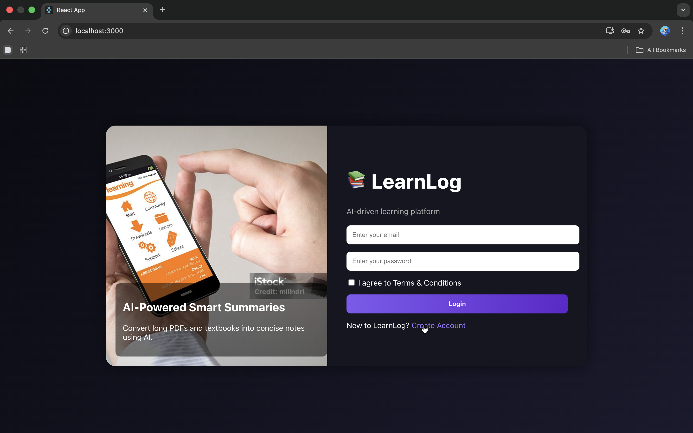
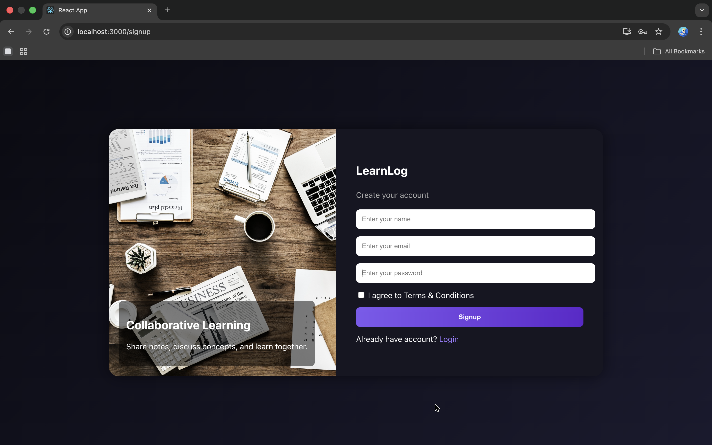
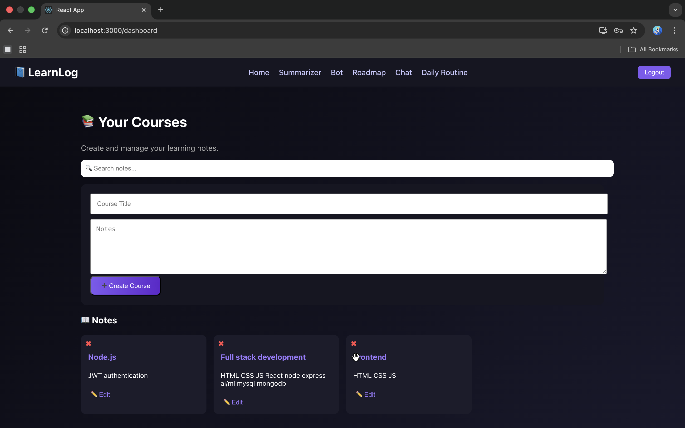
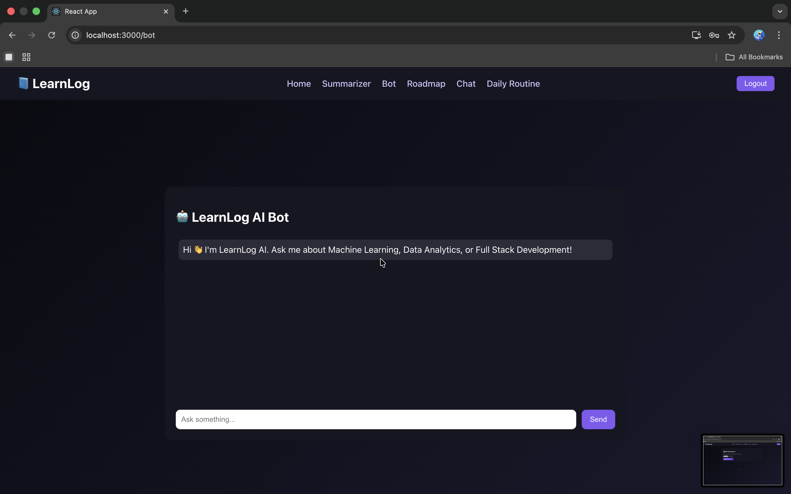
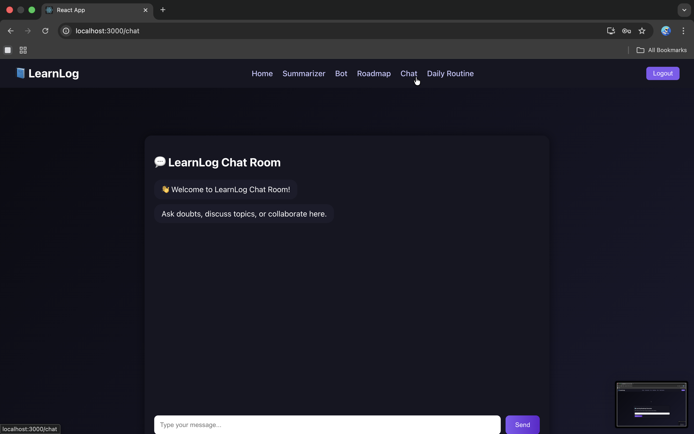
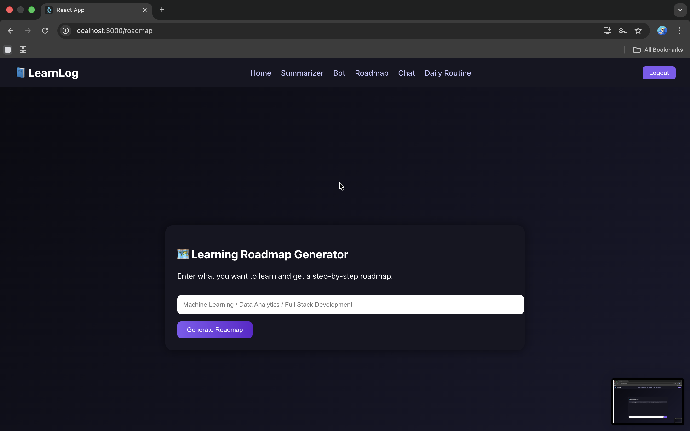
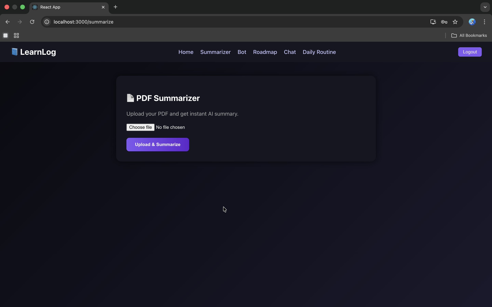
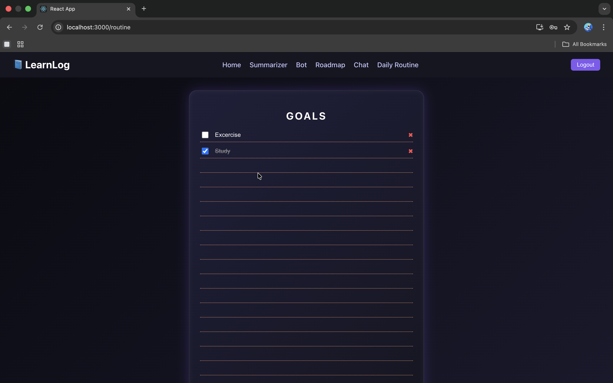

# 📚 LearnLog – Full Stack Learning Management System

LearnLog is a modern full-stack web application that helps students manage their learning in one place.  
It allows users to create courses, write notes, generate learning roadmaps, chat, summarize content, and manage daily goals using a clean and interactive UI.

This project is built using **React, Node.js, Express, and MongoDB** with authentication and protected routes.

---

## 🌟 Features

🔐 User Authentication (Login & Signup)  
📘 Create and Manage Courses  
📝 Notes Management with Search  
🗑️ Recycle Bin with Restore & Permanent Delete  
✏️ Edit Notes Anytime  
🧲 Drag and Drop Notes  
🗺️ Learning Roadmap Generator  
🤖 AI Bot (Keyword-based intelligent replies)  
💬 Chat Room with Save History  
📑 PDF/Text Summarizer  
🗓️ Daily Routine & Goals Manager  
🔍 Instant Search  
🎨 Modern UI with Gradient Theme  
🔒 Protected Routes using JWT  

---

## 🖥️ Screenshots

### 🔐 Login Page

### 📝 Signup Page

### 📊 Dashboard

### 🤖 AI Bot

### 💬  Chat Room

### 🗺️ Roadmap Generator

### 📄 Summarizer

### 🎯 Goals / Routine

---

## 🛠️ Tech Stack

Frontend  
• React.js  
• JavaScript  
• CSS  

Backend  
• Node.js  
• Express.js  

Database  
• MongoDB Atlas  

Authentication  
• JWT (JSON Web Token)  

Tools  
• Axios  
• React Router  
• VS Code  

---

## 📂 Project Structure

learnlog  
├── backend  
│   ├── controllers  
│   ├── routes  
│   ├── models  
│   ├── config  
│   └── server.js  
│  
├── frontend  
│   ├── src  
│   │   ├── pages  
│   │   ├── components  
│   │   ├── services  
│   │   └── styles  
│   └── App.js  

---

## 🚀 Installation & Setup

### Step 1: Clone the repository
git clone https://github.com/your-username/learnlog.git
### Step 2: Backend setup
cd backend
npm install
node server.js
### Step 3: Frontend setup
cd frontend
npm install
npm start
---

## 🔑 Environment Variables

Create a `.env` file inside backend folder:
MONGO_URI=your_mongodb_connection_string
JWT_SECRET=your_secret_key
---

## 🧠 How LearnLog Helps

• Create your own learning courses  
• Write notes for each topic  
• Organize tasks in Daily Routine  
• Generate learning roadmap  
• Chat and discuss concepts  
• Summarize study material  
• Search notes easily  
• Restore deleted notes from recycle bin  

---

## 📸 Application Modules

✔ Dashboard  
✔ Notes Manager  
✔ AI Bot  
✔ Roadmap Generator  
✔ Chat Room  
✔ PDF Summarizer  
✔ Daily Routine  
✔ Login & Signup  

---

## 🎯 Future Improvements

• Real AI integration  
• File upload support  
• Mobile responsive UI  
• Dark/Light mode  
• Collaboration between users  
• Progress tracking  

---

## 👨‍💻 Developer

**Nikhil Tiwari**  
Computer Science Student  
Passionate about Full Stack Development and AI  

---

## ⭐ Support

If you like this project, please ⭐ star the repository and share it.

---

## 📄 License

This project is developed for educational purposes only.
